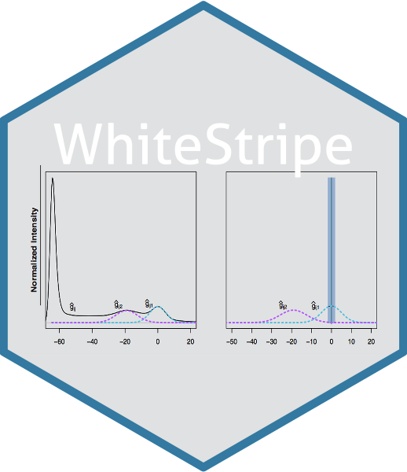

## White Stripe Package

Package for White Stripe segmentation algorithm presented in
[Statistical normalization techniques for magnetic resonance imaging](https://www.sciencedirect.com/science/article/pii/S221315821400117X)

